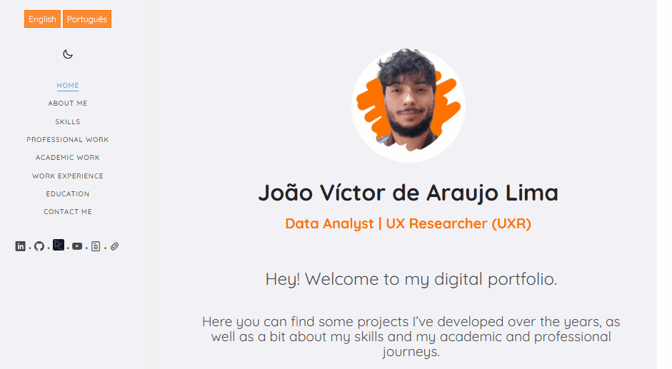
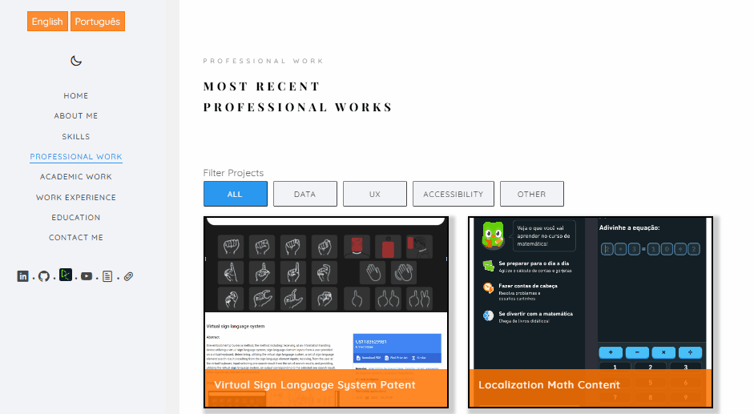
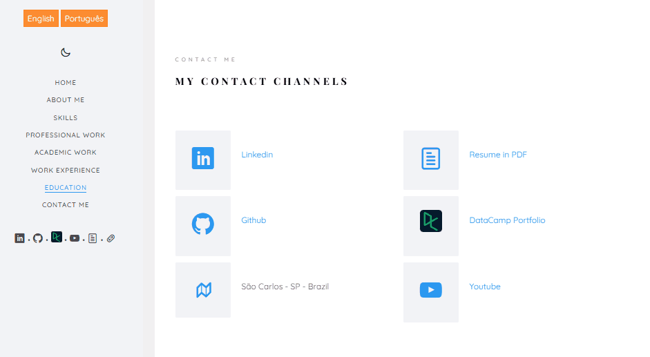

# My Web Portfolio - xuaun.github.io
## Languages
This first section is in English. 

[Versão em português logo abaixo.](#portuguese)

## Context
Page created to share some of my academic and scientific projects in digital format in the areas of ```Data```, ```UX```, ```Accessibility```, and others, such as ```Web```, ```Education```, ```Robotics```, and ```Localization```.

On this page you can also find a little about my academic and professional experience, as well as ways to get in touch with me.

## My portfolio settings and features
On this page, you can:
- Choose the display language
    - English
    - Portuguese
- Choose between light/dark mode
- Filter my projects by areas (such as data, UX, etc.)
- Access from both a computer and a cell phone
- Access other pages, such as my Linkedin, and download my CV

### Display language
Currently my portfolio is available in two languages: ```English``` (default language) and ```Portuguese```.

You can change the language in the side menu.

<p align="center">
    
</p>

### Light/dark mode
You can switch between light and dark modes in the side menu in my portfolio.

<p align="center">
    
</p>

### Filter projects
In both the **professional projects** section and the **other projects** section, you can filter projects by area.

<p align="center">
    
</p>

### Responsiveness - Computer / Mobile
The portfolio adapts to the screen of your device - responsiveness.

<p align="center">
    
</p>

### Other links
In several sections of my portfolio, such as in the **contact** section, you can access other links and download my CV.

<p align="center">
    
</p>

## How to use this survey
To access my web portfolio, access its web version at https://xuaun.github.io/.

## Technologies used
In this project, ```HTML```, ```CSS```, ```JavaScript``` were used.

____
<br>

# <p id="portuguese">Meu Portfólio Digital - xuaun.github.io</p>
## Contexto
Página criada para compartilhar alguns dos meus projetos acadêmicos e científicos em formato digital nas áreas de ```Dados```, ```UX```, ```Acessibilidade``` e outros, como ```Web```, ```Educação```, ```Robótica``` e ```Localização```.

Nesta página você também encontra um pouco sobre minhas trajetórias acadêmica e profissional, além de maneiras de entrar em contato.

## Configurações e características do meu portfólio
Nesta página, é possível:
- Escolher a língua de exibição
    - Português
    - Inglês
- Escolher entre modo claro/escuro
- Filtrar meus projetos por áreas (como dados, ux, etc.)
- Acessar tanto pelo computador, quanto pelo celular
- Acessar outras páginas, como meu Linkedin, e baixar meu cv

### Língua de exibição
Atualmente meu portfólio conta com duas línguas de exibição: ```Inglês``` (língua principal) e ```Português```.

Você pode trocar a língua de exibição no menu lateral.

<p align="center">
  
</p>

### Modo claro/escuro
Você pode alternar entre os modos claro e escuro pelo menu lateral no meu portfólio.

<p align="center">
  
</p>

### Filtrar projetos
Tanto na seção de **projetos profissionais**, quanto na seção de **outros projetos**, é possível filtrar os projetos por área.

<p align="center">
  
</p>

### Responsividade - Computador / Celular
O portfólio se adequa à tela do seu dispositivo - responsividade.

<p align="center">
  
</p>

### Outros links
Em vários trechos do meu portfólio, como na seção **contato**, é possível acessar outros links e baixar meu cv.

<p align="center">
  
</p>

## Instruções de uso
Para acessar meu portfólio digital, acesse sua versão web em [https://xuaun.github.io/](https://xuaun.github.io/pt/index.html).

## Tecnologias utilizadas
Neste projeto, foi utilizado ```HTML```, ```CSS```, ```JavaScript```.
